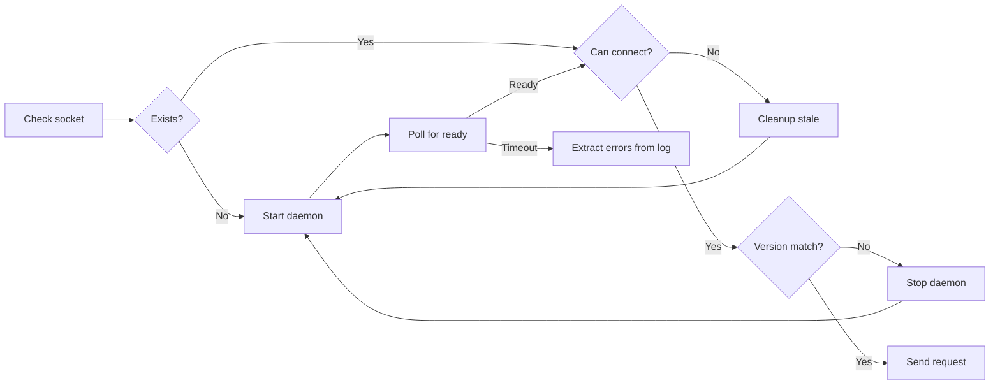
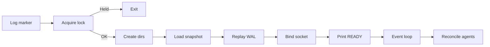

# Daemon Architecture

The system splits into two processes: `oj` (CLI) and `ojd` (daemon).

## Purpose

The core purpose of oj is **background work dispatch** - running agents in isolated sessions while the user does other things. This requires a persistent process that:

1. Receives commands from CLI
2. Runs the event loop
3. Spawns and monitors agents
4. Drives jobs through steps
5. Persists state for crash recovery

## Process Architecture

```diagram
┌─────────────────────────────────────────────────────────────┐
│  oj (CLI)                                    crates/cli     │
│                                                             │
│  1. Find project root (walk up for .oj/)                    │
│  2. Connect to user's daemon (auto-start if needed)         │
│  3. Send request with project_root, receive response        │
└─────────────────────────┬───────────────────────────────────┘
                          │
                          │  Unix socket: ~/.local/state/oj/daemon.sock
                          ▼
┌─────────────────────────────────────────────────────────────┐
│  ojd (Daemon)                                crates/daemon  │
│                                                             │
│  Persistent process that owns the event loop:               │
│                                                             │
│  ┌───────────────────────────────────────────────────────┐  │
│  │  Event Loop (main thread)                             │  │
│  │                                                       │  │
│  │  loop {                                               │  │
│  │      select! {                                        │  │
│  │          event = event_reader.recv() => process(event) │  │
│  │          _ = shutdown.notified() => break             │  │
│  │          _ = sigterm/sigint => break                   │  │
│  │          _ = interval(1s) => check_timers()           │  │
│  │      }                                                │  │
│  │  }                                                    │  │
│  │                                                       │  │
│  │  Spawned tasks: listener, checkpoint, flush           │  │
│  └───────────────────────────────────────────────────────┘  │
│                                                             │
│  Owns:                                                      │
│  - State (jobs, sessions, workspaces)                  │
│  - Adapters (tmux, git)                                     │
│  - Storage (WAL)                                            │
└─────────────────────────────────────────────────────────────┘
```

## Directory Layout

One daemon serves all projects for a user:

```example
~/.local/state/oj/
├── daemon.sock          # Unix socket
├── daemon.pid           # Lock file (contains PID)
├── daemon.version       # Version file (for mismatch detection)
├── daemon.log           # Daemon logs
├── snapshot.json        # State snapshot
├── wal/
│   └── events.wal       # Write-ahead log
├── logs/                # Per-job and per-agent logs
│   ├── <job-id>.log
│   └── agent/
│       ├── <agent-id>.log
│       └── <agent-id>/  # Agent session JSONL
└── workspaces/
    └── <name>/          # Git worktrees for ephemeral workspaces
```

**Why user-level:**
- Simpler architecture (single daemon process)
- Cross-project visibility (one place to see all jobs)
- CLI passes `project_root` with each `RunCommand` request

## Why a Daemon?

Without a daemon, each CLI invocation would need to:
- Load state from WAL
- Execute one step
- Exit

This creates problems:
- **No continuous monitoring** - can't detect stuck agents
- **Race conditions** - multiple CLI invocations could conflict
- **No event loop** - shell completions can't trigger next steps
- **Inefficient** - constant WAL replay on every command

The daemon solves these by being a single owner of state and the event loop.

## IPC Protocol

**Transport:** Unix socket

**Format:** Length-prefixed JSON (4-byte big-endian length prefix + JSON payload)

```rs
enum Request {
    // Core operations
    Ping                                // Health check
    Hello { version }                   // Version handshake
    Status                              // Detailed status
    Event { event }                     // Deliver event to event loop
    Query { query }                     // Read state
    Shutdown { kill }                   // Graceful shutdown (kill: terminate sessions)
    RunCommand { project_root, invoke_dir, namespace, command, args, named_args }

    // Session operations
    SessionSend { id, input }           // Send input to a session
    SessionKill { id }                  // Kill a session
    PeekSession { session_id, with_color }  // Capture tmux pane output

    // Agent operations
    AgentSend { agent_id, message }     // Send input to an agent
    AgentResume { agent_id, kill, all } // Resume dead agents

    // Session operations
    SessionPrune { all, dry_run, namespace }  // Prune orphaned sessions

    // Job operations
    JobResume { id, message, vars, kill, all }  // Resume escalated job
    JobResumeAll { kill }               // Resume all resumable jobs
    JobCancel { ids }                   // Cancel jobs by ID
    JobPrune { all, failed, orphans, dry_run, namespace }  // Prune terminal jobs

    // Workspace operations
    WorkspaceDrop { id }                // Delete workspace by ID
    WorkspaceDropFailed                 // Delete failed workspaces
    WorkspaceDropAll                    // Delete all workspaces
    WorkspacePrune { all, dry_run, namespace }  // Prune old workspaces
    AgentPrune { all, dry_run }         // Prune agent logs

    // Worker operations
    WorkerStart { project_root, namespace, worker_name, all }
    WorkerStop { worker_name, namespace, project_root }
    WorkerRestart { project_root, namespace, worker_name }
    WorkerResize { worker_name, namespace, concurrency }
    WorkerWake { worker_name, namespace }
    WorkerPrune { all, dry_run, namespace }

    // Cron operations
    CronStart { project_root, namespace, cron_name, all }
    CronStop { cron_name, namespace, project_root }
    CronRestart { project_root, namespace, cron_name }
    CronOnce { project_root, namespace, cron_name }
    CronPrune { all, dry_run }

    // Queue operations
    QueuePush { project_root, namespace, queue_name, data }
    QueueDrop { project_root, namespace, queue_name, item_id }
    QueueRetry { project_root, namespace, queue_name, item_ids, all_dead, status }
    QueueRetryBulk { project_root, namespace, queue_name, item_ids, all_dead, status_filter }
    QueueDrain { project_root, namespace, queue_name }
    QueueFail { project_root, namespace, queue_name, item_id }
    QueueDone { project_root, namespace, queue_name, item_id }
    QueuePrune { project_root, namespace, queue_name, all, dry_run }

    // Decision operations
    DecisionResolve { id, chosen, message }
}

enum Query {
    // Jobs
    ListJobs
    GetJob { id }
    GetJobLogs { id, lines }

    // Agents
    ListAgents { job_id, status }
    GetAgent { agent_id }
    GetAgentLogs { id, step, lines }
    GetAgentSignal { agent_id }

    // Sessions
    ListSessions
    GetSession { id }

    // Workspaces
    ListWorkspaces
    GetWorkspace { id }

    // Workers
    ListWorkers
    GetWorkerLogs { name, namespace, lines, project_root }

    // Crons
    ListCrons
    GetCronLogs { name, namespace, lines, project_root }

    // Queues
    ListQueues { project_root, namespace }
    ListQueueItems { queue_name, namespace, project_root }
    GetQueueLogs { queue_name, namespace, lines }

    // Decisions
    ListDecisions { namespace }
    GetDecision { id }

    // Overview
    StatusOverview
    ListProjects
    ListOrphans
    DismissOrphan { id }
}

enum Response {
    // Basic responses
    Ok
    Pong
    Hello { version }
    ShuttingDown
    Event { accepted }
    Error { message }
    Status { uptime_secs, jobs_active, sessions_active, orphan_count }

    // Job responses
    Jobs { jobs }
    Job { job }
    JobLogs { log_path, content }
    CommandStarted { job_id, job_name }
    JobsCancelled { cancelled, already_terminal, not_found }
    JobsPruned { pruned, skipped }

    // Agent responses
    Agents { agents }
    Agent { agent }
    AgentLogs { log_path, content, steps }
    AgentSignal { signaled, kind, message }
    AgentRunStarted { agent_run_id, agent_name }
    AgentsPruned { pruned, skipped }
    AgentResumed { resumed, skipped }

    // Job resume responses
    JobsResumed { resumed, skipped }

    // Session responses
    Sessions { sessions }
    Session { session }
    SessionPeek { output }
    SessionsPruned { pruned, skipped }

    // Workspace responses
    Workspaces { workspaces }
    Workspace { workspace }
    WorkspacesDropped { dropped }
    WorkspacesPruned { pruned, skipped }

    // Worker responses
    Workers { workers }
    WorkerStarted { worker_name }
    WorkersStarted { started, skipped }
    WorkerResized { worker_name, old_concurrency, new_concurrency }
    WorkerLogs { log_path, content }
    WorkersPruned { pruned, skipped }

    // Cron responses
    Crons { crons }
    CronStarted { cron_name }
    CronsStarted { started, skipped }
    CronLogs { log_path, content }
    CronsPruned { pruned, skipped }

    // Queue responses
    Queues { queues }
    QueueItems { items }
    QueuePushed { queue_name, item_id }
    QueueDropped { queue_name, item_id }
    QueueRetried { queue_name, item_id }
    QueueItemsRetried { queue_name, item_ids, already_retried, not_found }
    QueueDrained { queue_name, items }
    QueueFailed { queue_name, item_id }
    QueueCompleted { queue_name, item_id }
    QueueLogs { log_path, content }
    QueuesPruned { pruned, skipped }

    // Decision responses
    Decisions { decisions }
    Decision { decision }
    DecisionResolved { id }

    // Overview responses
    StatusOverview { uptime_secs, namespaces, metrics_health }
    Projects { projects }
    Orphans { orphans }
}
```

## Event Loop

The daemon runs a continuous event loop:

```
┌─────────────────────────────────────────────────────────────┐
│                     Event Sources                       │
│                                                         │
│  ┌─────────┐  ┌─────────────┐  ┌──────────┐             │
│  │   IPC   │  │  Internal   │  │  Timers  │             │
│  │ (socket)│  │   Queue     │  │          │             │
│  └────┬────┘  └──────┬──────┘  └────┬─────┘             │
│       │              │              │                   │
│       └──────────────┼──────────────┘                   │
│                      ▼                                  │
│              ┌───────────────┐                          │
│              │  Event Loop   │                          │
│              └───────┬───────┘                          │
│                      │                                  │
│                      ▼                                  │
│              ┌───────────────┐                          │
│              │    Runtime    │                          │
│              │  (engine)     │                          │
│              └───────┬───────┘                          │
│                      │                                  │
│                      ▼                                  │
│              ┌───────────────┐                          │
│              │   Effects     │───────┐                  │
│              └───────────────┘       │                  │
│                      │               │                  │
│      ┌───────────────┼───────────────┼──────┐           │
│      ▼               ▼               ▼      ▼           │
│  ┌───────┐     ┌─────────┐    ┌──────┐ ┌───────┐        │
│  │ tmux  │     │ notify  │    │ WAL  │ │ Queue │        │
│  │Adapter│     │ Adapter │    │      │ │(intern)│       │
│  └───────┘     └─────────┘    └──────┘ └───────┘        │
│                                              │          │
│                                              │          │
│                      Internal events ◄───────┘          │
│                      (ShellExited, etc.)             │
└─────────────────────────────────────────────────────────┘
```

Effects that produce events (like `Effect::Shell`) feed results back into the internal queue, creating the progression chain.

## Lifecycle

### Startup

```
1. Write startup marker to log ("--- ojd: starting (pid: <pid>)")
2. Acquire lock file (prevent multiple daemons)
3. Create directories, write version file
4. Load snapshot, then replay WAL
5. Set up adapters and runtime
6. Bind socket
7. Print READY, enter event loop
8. Reconcile with reality (background task, after READY)
```

**Startup Error Reporting:**

When the CLI starts the daemon and it fails, errors are reported via the log:

1. Daemon writes `--- ojd: starting (pid: <pid>)` marker before anything else
2. CLI waits for socket to appear (with timeout)
3. If timeout, CLI reads log from last marker, extracts ERROR lines
4. Error message shown to user instead of generic "timeout"

This ensures runbook parse errors, permission issues, etc. are visible to the user.

### Shutdown

By default, `oj daemon stop` preserves tmux sessions. Agents continue running
independently — on next startup, the reconciliation flow reconnects to survivors
and resumes job progression. This is critical for long-running agents that
may take hours; a daemon restart (e.g., for version upgrade) should not kill work
in progress.

```
1. Break event loop
2. Flush buffered WAL events to disk
3. Save final snapshot (fast subsequent startup)
4. Remove socket file (stops new connections)
5. Remove PID and version files
6. Release lock file
7. Exit (sessions left alive)
```

Use `oj daemon stop --kill` to terminate all sessions before stopping. This kills
every session tracked in the daemon's state (scoped to this daemon instance, safe
for parallel runs). Kills happen in the IPC request handler before the response is
sent, so they complete before the CLI's exit timer starts.

### Recovery

On restart after crash (or normal restart with surviving sessions):

```
1. Replay WAL to reconstruct state
2. Reconcile:
   - Prune orphaned sessions from terminal/missing jobs
   - Resume running workers (re-emit WorkerStarted)
   - Resume running crons (re-emit CronStarted)
   - For standalone agent runs and jobs:
     check tmux sessions and agent processes
3. Reconnect watchers or trigger on_dead actions
```

The WAL records intent; reconciliation bridges the gap with reality. This is why
session preservation is the default — the restart+reconcile flow is designed to
pick up exactly where the daemon left off.

## CLI Connection Protocol

CLI finds the project root by walking up from cwd looking for `.oj/` directory:

```example
<project>/
└── .oj/
    ├── config.toml          # Project config (optional)
    └── runbooks/            # Runbook files
        ├── build.hcl
        ├── bugfix.hcl
        └── ...
```

Then connects to the daemon (auto-starting if needed):



1. **Check socket file**
   - If socket doesn't exist → start daemon

2. **Attempt connection**
   - If socket exists but connect fails → stale socket from crashed daemon

3. **Cleanup stale files**
   1. Check if PID file exists
   2. If PID exists, verify process is dead via `kill(pid, 0)`
   3. If dead (or no PID file), remove socket and PID files
   4. Proceed with fresh daemon start

4. **Version check**
   1. Compare CLI version against `daemon.version` file
   2. If mismatch, print warning
   3. Stop old daemon via SIGTERM (graceful, then force-kill if needed)
   4. Start fresh daemon with current version

5. **Poll for daemon ready**
   - Poll socket with 50ms interval (`OJ_CONNECT_POLL_MS`)
   - Timeout after 5s (`OJ_TIMEOUT_CONNECT_MS`)
   - Non-blocking `try_wait()` detects early daemon exit

6. **Error reporting on timeout**
   1. Read daemon log file
   2. Find last startup marker (`--- ojd: starting (pid: <pid>)`)
   3. Extract ERROR lines after marker
   4. Display to user instead of generic "connection timeout"

## Daemon Startup Sequence



1. **Write log marker**
   - Write `--- ojd: starting (pid: <pid>)` before anything else
   - CLI uses this to find relevant errors on startup failure

2. **Acquire lock**
   - Open PID file without truncating (preserves running daemon's PID)
   - Non-blocking `try_lock_exclusive()` on PID file
   - Fails immediately if another daemon holds lock (no waiting)
   - Only after lock is acquired: truncate and write current PID
   - OS releases lock automatically when process dies
   - On `LockFailed`, skip cleanup—existing files belong to the running daemon

3. **Create directories**
   - `create_dir_all()` for: socket parent, WAL parent, workspaces
   - Idempotent—safe if directories already exist
   - Write `daemon.version` file (CLI uses this for version mismatch detection)

4. **Load snapshot**
   - Parse JSON snapshot file
   - On corruption:
     1. Move corrupt file to `.bak`
     2. Log warning with error details
     3. Continue with empty state

5. **Replay WAL**
   - Parse each JSON line after snapshot sequence number
   - On corruption:
     1. Collect valid entries before corruption point
     2. Rename corrupt WAL to `.bak`
     3. Create clean WAL with valid entries only
     4. Log warning with entry count
   - Backup rotation: `.bak` → `.bak.2` → `.bak.3` (max 3 kept)

6. **Set up adapters and runtime**
   - Create traced adapters (tmux session, claude agent) and notify adapter
   - Create internal event channel for runtime-produced events
   - Spawn runtime event forwarder (internal channel → EventBus)

7. **Bind socket**
   - Remove stale socket file (safe—lock already acquired)
   - Bind to socket path
   - On failure, cleanup partial state (socket, PID, version files)
   - Cleanup only runs for post-lock failures; lock contention skips cleanup entirely

8. **Print READY**
   - Signal that daemon is accepting connections
   - CLI polls for socket availability after this

9. **Enter event loop**
   - Spawn async tasks: listener, checkpoint, flush
   - No blocking—all work in separate tasks

10. **Reconcile state** (background)
    - Spawned AFTER ready—doesn't block CLI
    - **Sessions:** Prune orphaned sessions whose jobs are terminal or missing
    - **Workers:** Re-emit `WorkerStarted` for each running worker (resumes queue polling)
    - **Crons:** Re-emit `CronStarted` for each running cron (resumes scheduling)
    - **Standalone agent runs:** Same 3-case check as jobs (below)
    - **Jobs:** For each non-terminal job, check agent state:

    | Condition | Action |
    |-----------|--------|
    | Session alive, agent running | Reconnect file watcher |
    | Session alive, agent dead | Emit `AgentExited` |
    | Session dead | Emit `AgentGone` |

    - Jobs in `Waiting` state skipped (already escalated to human)

### Atomic Writes and Durability

Snapshots use the full durability sequence for crash safety:

1. Serialize state + compress with zstd (background thread)
2. Write to `.tmp` file
3. `fsync` the temp file (data durable)
4. Atomic rename to final path
5. `fsync` parent directory (rename durable)
6. **Only then** truncate WAL

The directory fsync is critical: without it, a power failure after rename but
before the directory is synced could revert to the old snapshot while the WAL
has already been truncated, losing events.

WAL truncation also uses temp-then-rename. Regular WAL writes are append-only
with buffered group commit (~10ms window) followed by `sync_all()`.

### Background Checkpoints

Checkpoint I/O runs off the main thread to minimize latency:

```diagram
Main Thread                 Background Thread
clone state (~10ms)    →    serialize + compress + I/O (~200ms)
continue processing         └→ completion signal
                       ←
truncate WAL
```

At 1-2k jobs, this keeps main thread blocking under 10ms while the full
checkpoint (including compression and fsyncs) takes ~200ms in the background.

## Daemon Management

```bash
# Start daemon (background)
oj daemon start

# Start in foreground (debugging)
oj daemon start --foreground

# Check status
oj daemon status

# Stop gracefully (sessions preserved for restart+reconcile)
oj daemon stop

# Stop and terminate all sessions
oj daemon stop --kill

# View logs
oj daemon logs
oj daemon logs -f  # watch logs
```

### Auto-Start

The daemon auto-starts on first command if not already running:

```
connect_or_start():
    if can connect to socket:
        return connection
    else:
        start daemon in background
        retry connect with 5s timeout
        return connection
```

This provides seamless UX - users don't need to think about daemon lifecycle for normal usage. Explicit `oj daemon start` is only needed for debugging or custom configurations.

## Environment Variables

### CLI

| Variable | Default | Description |
|----------|---------|-------------|
| `OJ_STATE_DIR` | `~/.local/state/oj` | Base directory for all daemon state (socket, PID, WAL, workspaces, logs). Falls back to `$XDG_STATE_HOME/oj`. Useful for test isolation. |
| `OJ_NAMESPACE` | Auto-detected | Project namespace for resource isolation. Auto-detected from `.oj/config.toml [project].name` or directory basename. Propagated to agents and shell steps so nested `oj` calls inherit the parent project's namespace. |
| `OJ_DAEMON_BINARY` | Auto-detected | Path to the `ojd` binary. Auto-detected from the current executable's location. |
| `OJ_TIMEOUT_IPC_MS` | `5000` | Timeout for IPC requests between CLI and daemon. |
| `OJ_TIMEOUT_CONNECT_MS` | `5000` | Timeout for waiting for daemon to start when auto-starting. |
| `OJ_TIMEOUT_EXIT_MS` | `2000` | Timeout for graceful process exit before force-kill. |
| `OJ_CONNECT_POLL_MS` | `50` | Polling interval for connection retries to daemon socket. |
| `OJ_RUN_WAIT_MS` | `10000` | Initial wait after `oj run` spawns a job before returning. |
| `OJ_WAIT_POLL_MS` | `1000` | Polling interval for `oj job wait` and `oj agent wait`. |

### Daemon / Adapters

| Variable | Default | Description |
|----------|---------|-------------|
| `OJ_IDLE_GRACE_MS` | `60000` | Grace period before confirming idle. After an `AgentIdle` event, the engine waits this long, then re-checks log growth and agent state before triggering `on_idle`. |
| `OJ_PROMPT_POLL_MS` | `3000` | Timeout for detecting and handling Claude Code prompts (permissions bypass, workspace trust). |
| `OJ_SESSION_POLL_MS` | `1000` | Polling interval while waiting for an agent's session log to appear after spawn. |
| `OJ_WATCHER_POLL_MS` | `5000` | Fallback polling interval for agent watcher when file-based monitoring isn't available. |
| `OJ_TIMER_CHECK_MS` | `1000` | Interval for the main loop's timer check branch (how often fired timers are collected). |

## See Also

- [Overview](00-overview.md) - System architecture
- [Effects](02-effects.md) - Effect types
- [Storage](04-storage.md) - WAL persistence
